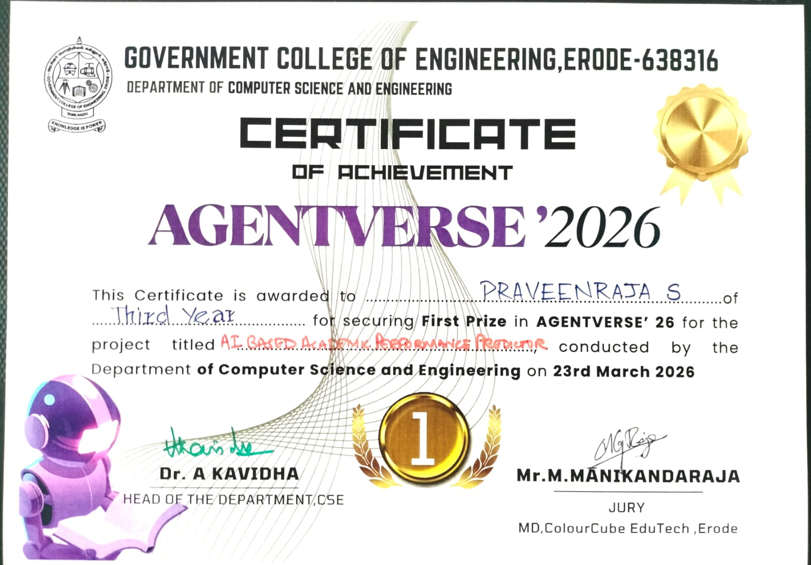

  <h1>🚀 Genesis</h1>
  <h3>The Ultimate AI-Powered College Management Ecosystem</h3>

 

**Genesis** is an award-winning, comprehensive platform engineered to bridge the gap between Students, Advisors, and Department Heads. It provides an all-in-one ecosystem for academic tracking, personal AI mentoring, granular data filtering, and real-time messaging, encapsulated in a premium "glassmorphism" UI.

🏆 **1st Place Winner at AGENTVERSE** 🏆

---

## 🏅 Award Certificate

---

## ✨ Core Components & Architecture

We built Genesis to solve fragmented college data management by combining robust database systems with state-of-the-art Generative AI. 

### 🎓 1. Role-Based Ecosystem & Dashboards
*   **Distinct Portals:** Separate, secure login portals and dashboard views for Students, Advisors, and HODs (Head of Department).
*   **Dynamic Data Routing:** Secure data access tailored entirely to user privileges. Advisors only see their specific cohorts, while Admins/HODs have global view access.

### 🧠 2. K-Means Clustering & Radar Graphs
*   **Algorithmic Analysis:** We implemented computationally advanced logic using **K-Means Clustering** to segment students based on their technical skills, aptitude scores, and academic performances.
*   **Visual Data Mapping:** This multi-dimensional clustering data is beautifully rendered to the user via interactive **Radar Graphs**, giving faculty incredibly fast visual maps of a student's core competencies.

### 🤖 3. Drag-and-Drop Staff AI Analytics Engine
*   **Intuitive Drag-and-Drop UX:** Staff can grab their bulk `.xlsx` datasets and simply drag-and-drop them into the interface without dealing with clunky file explorers. 
*   **Chat with your Files:** Powered by **Groq (Meta Llama 3)** and **Google Gemini** APIs. Once the file is dropped into the PostgreSQL database, staff can instantly type questions about the dataset directly into the chat system.
*   **Dynamic Chart Generation:** The LLM returns structured JSON that our frontend parses to dynamically generate visual dashboard charts instantly based on the queries.

### ⚡ 4. n8n Automation Workflows
*   **Webhook Integrations:** Integrated **n8n** automation pipelines directly into the application ecosystem, allowing our system to trigger advanced, automated external messaging and cross-platform notification pipelines effortlessly based on database events.

### 🎓 5. Personal AI Student Mentor
*   **Context-Aware Advice:** Students have an exclusive LLM mentor that automatically ingests their precise academic profile. By feeding the LLM their specific GPA history, technical skills, and weaknesses, it acts as a hyper-personalized career and study guide.

### 💬 6. Real-Time Inter-Portal Messaging
*   **Cross-Platform Chat:** A robust SQL-backed messaging system enabling instant communication between students and faculty. Includes active contact mapping, read receipts, and full chat history logging.

### 🌟 7. The "Spotlight" Algorithm
*   **Top Achiever Scanner:** A custom algorithmic scanner that parses the loaded dataset to automatically identify and spotlight the top-performing students across specific faculty cohorts.

### 📝 8. Live Skill-Check Scoreboard
*   **Assessment Tracking:** A real-time assignment system allowing students to submit tasks and scores, while administrators and staff view a live, dynamically updated leaderboard matrix.

---

## 📸 AGENTVERSE Showcase Gallery

Here is a full visual walkthrough of the Genesis platform, showcasing our defining modules, drag-and-drop dashboards, n8n automations, chat interfaces, radar graphs, and dynamic data tables that won us 1st place!

  

  

  

  

  

  

  

  

  

  

  

  

  

  

  

  

  

  

---

## 🛠️ Technical Stack

**Frontend Design:** HTML5 & CSS3 (Premium Glassmorphism Aesthetic), Vanilla JavaScript, Chart.js (Radar Mapping).
**Backend Logic:** Python (Flask) REST APIs, SQLAlchemy, Pandas (K-Means Data Handling).
**AI & Automations:** Groq API (Llama 3), Google Gemini API, **n8n Automation Engine**.
**Deployment & DB:** Render, Enterprise PostgreSQL.

 

  <i>Built with ❤️ by Praveenraja and the Genesis Team</i>

