

  <h1>🚀 Genesis</h1>
  <h3>The Ultimate AI-Powered College Management Ecosystem</h3>

 

**Genesis** is an award-winning, comprehensive platform engineered to bridge the gap between Students, Advisors, and Department Heads. It provides an all-in-one ecosystem for academic tracking, personal AI mentoring, granular data filtering, and real-time messaging, encapsulated in a premium "glassmorphism" UI.

🏆 **1st Place Winner at AGENTVERSE** 🏆

---

## 🏅 Award Certificate

*(Note: Add your certificate photo to the `screenshots` folder and name it `certificate.png` to display it here!)*

---

## ✨ Core Components & Architecture

We built Genesis to solve fragmented college data management by combining robust database systems with state-of-the-art Generative AI. 

### 🎓 1. Role-Based Ecosystem & Dashboards
*   **Distinct Portals:** Separate, secure login portals and dashboard views for Students, Advisors, and HODs (Head of Department).
*   **Dynamic Data Routing:** Secure data access tailored entirely to user privileges. Advisors only see their specific cohorts, while Admins/HODs have global view access.

### 🤖 2. Staff AI Data Analytics Engine
*   **Instant Excel Chat:** Powered by **Groq (Meta Llama 3)** and **Google Gemini** APIs. Staff can directly upload `.xlsx` datasets to the PostgreSQL database and interactively "chat" with their data.
*   **Dynamic Chart Generation:** The LLM returns structured JSON that our frontend parses to dynamically generate visual dashboard charts instantly based on the queries.

### 🧠 3. Personal AI Student Mentor
*   **Context-Aware Advice:** Students have an exclusive LLM mentor that automatically ingests their precise academic profile. By feeding the LLM their specific GPA history, technical skills, and weaknesses, it acts as a hyper-personalized career and study guide.

### 💬 4. Real-Time Inter-Portal Messaging
*   **Cross-Platform Chat:** A robust SQL-backed messaging system enabling instant communication between students and faculty.
*   **Smart Tracking:** Includes active contact mapping, read receipts, and full chat history logging.

### 📊 5. Dynamic Student Profiling
*   **Comprehensive Metrics:** The student dashboard visualizes deep insights, pulling directly from PostgreSQL to map out current CGPA, attendance metrics, mock interview ratings, aptitude scores, arrear history, and career goals all in one glassmorphism card UI.

### 🌟 6. The "Spotlight" Algorithm
*   **Top Achiever Scanner:** A custom algorithmic scanner that parses the loaded dataset to automatically identify and spotlight the top-performing students across specific faculty cohorts, providing an immediate snapshot of top talent.

### 📝 7. Live Skill-Check Scoreboard
*   **Assessment Tracking:** A real-time assignment system allowing students to submit tasks and scores, while administrators and staff view a live, dynamically updated leaderboard matrix.

---

## 📸 AGENTVERSE Showcase Gallery

Here is a full visual walkthrough of the Genesis platform, showcasing our 20 defining modules, dashboards, chat interfaces, and dynamic data tables that won us 1st place!

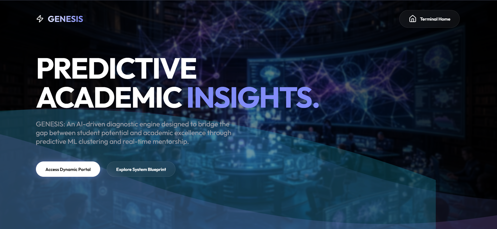
  
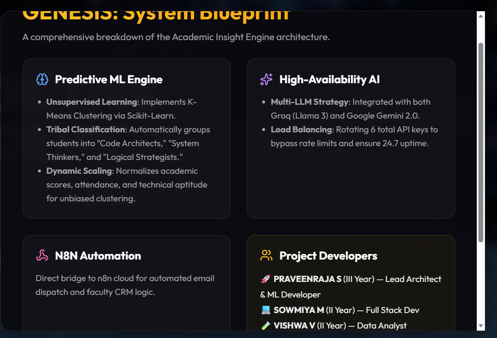
  
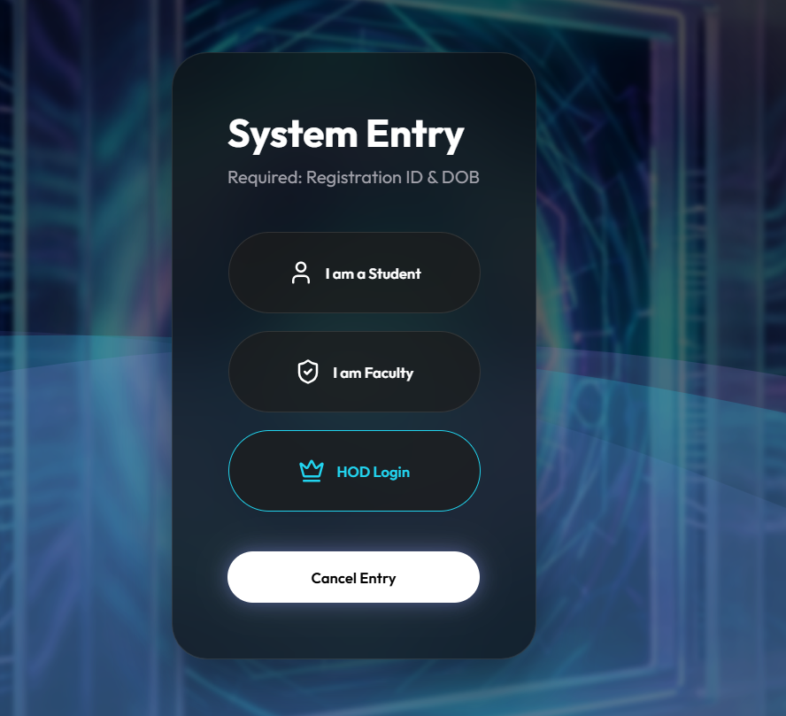
  
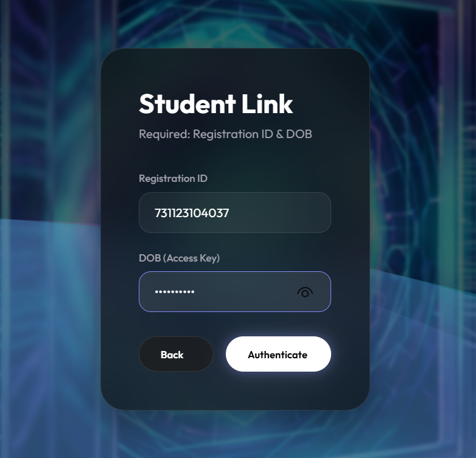
  
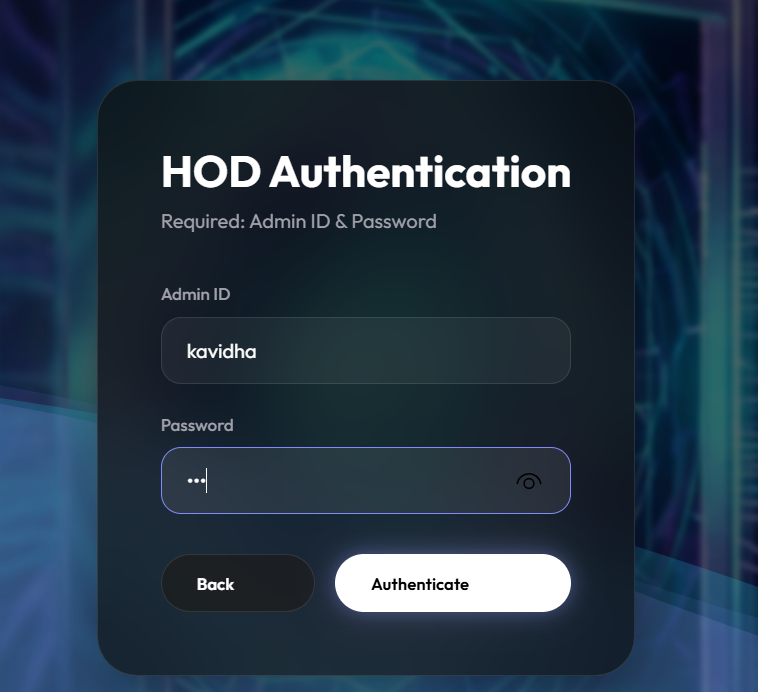
  
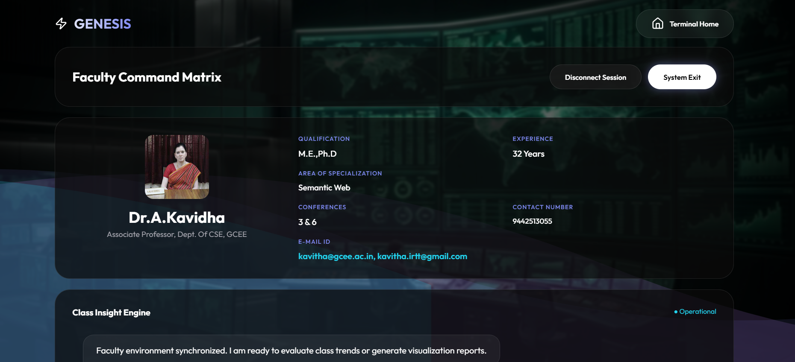
  
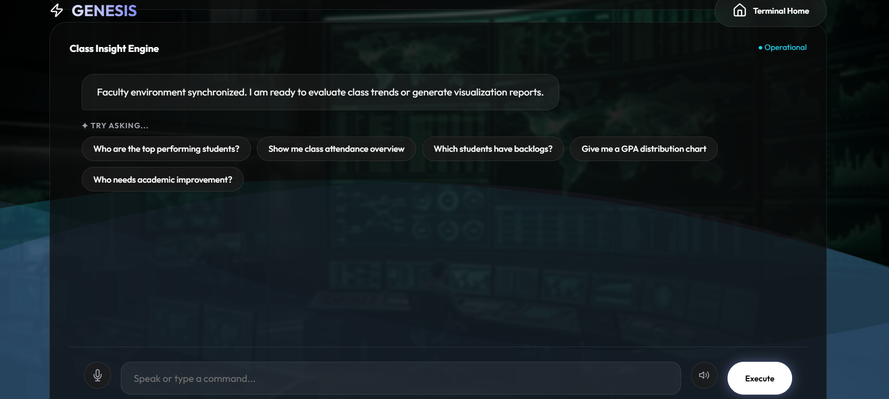
  
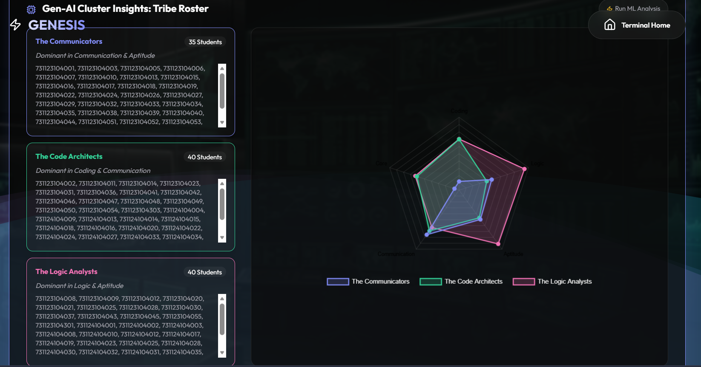
  
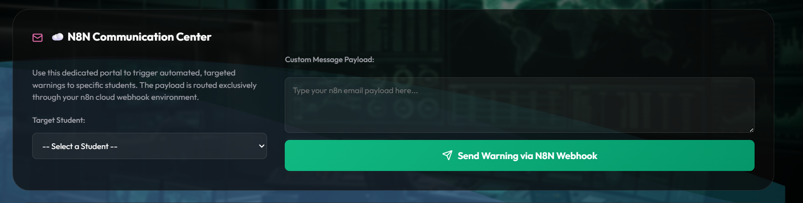
  
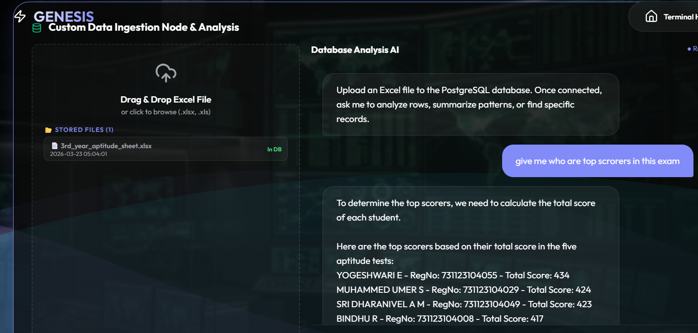
  
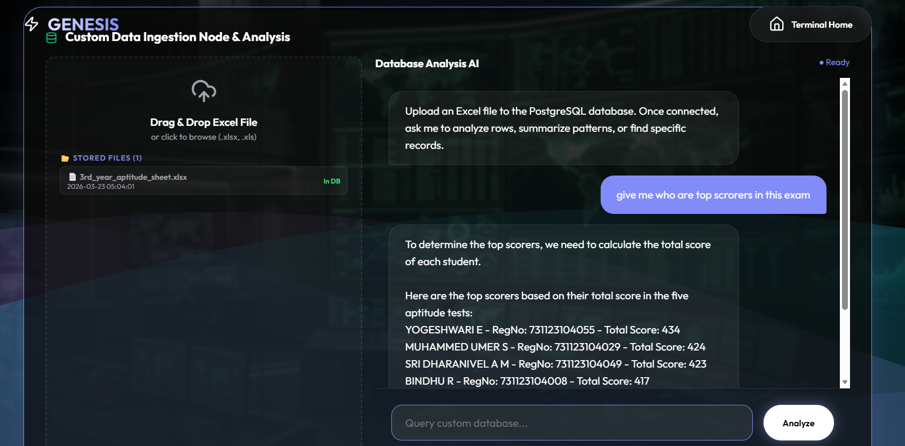
  
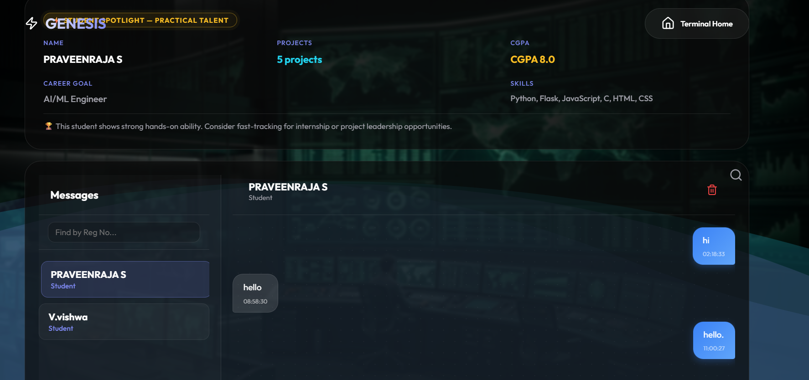
  
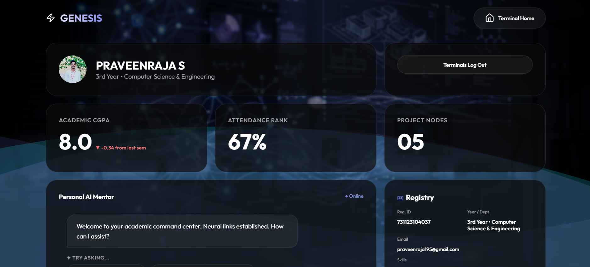
  

  

  

  

  
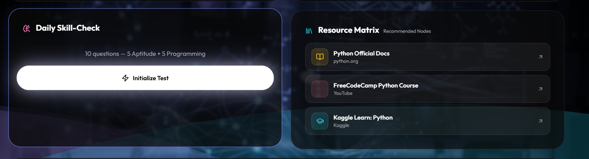
  
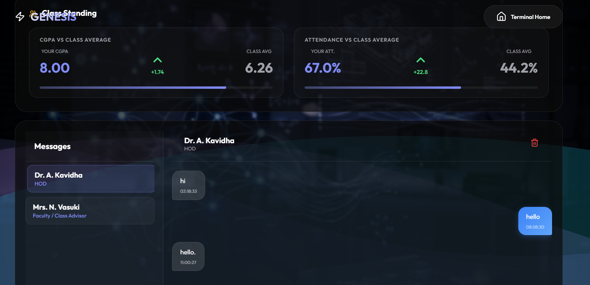
  
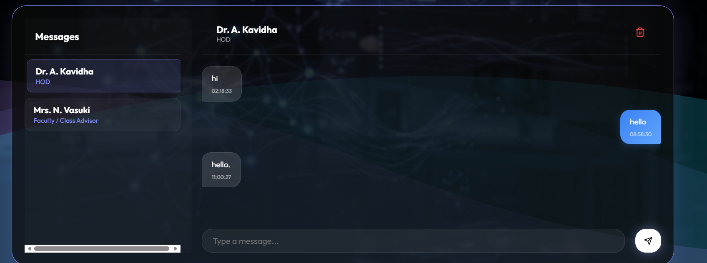

---

## 🛠️ Technical Stack

**Frontend Design:** HTML5 & CSS3 (Premium Glassmorphism Aesthetic), Vanilla JavaScript.
**Backend Logic:** Python (Flask) REST APIs, SQLAlchemy, Pandas.
**AI Integration:** Groq API (Llama-3.3-70b-versatile), Google Gemini API (Fallback).
**Deployment & DB:** Render, Enterprise PostgreSQL.

 

  <i>Built with ❤️ by Praveenraja195 and the Genesis Team</i>

